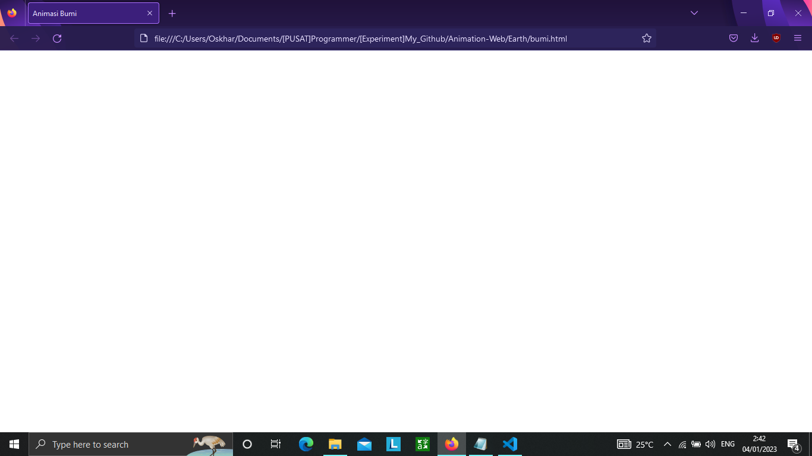
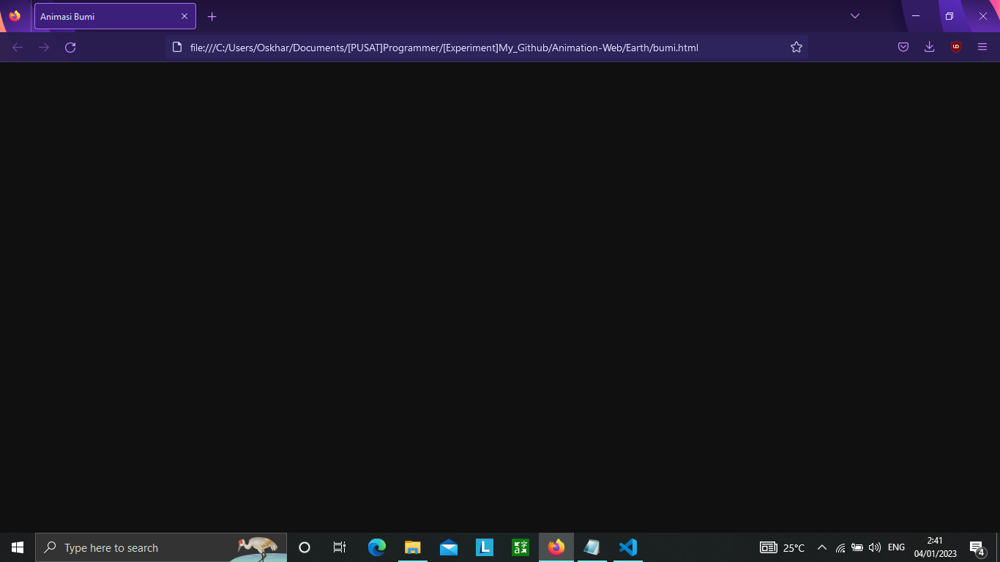
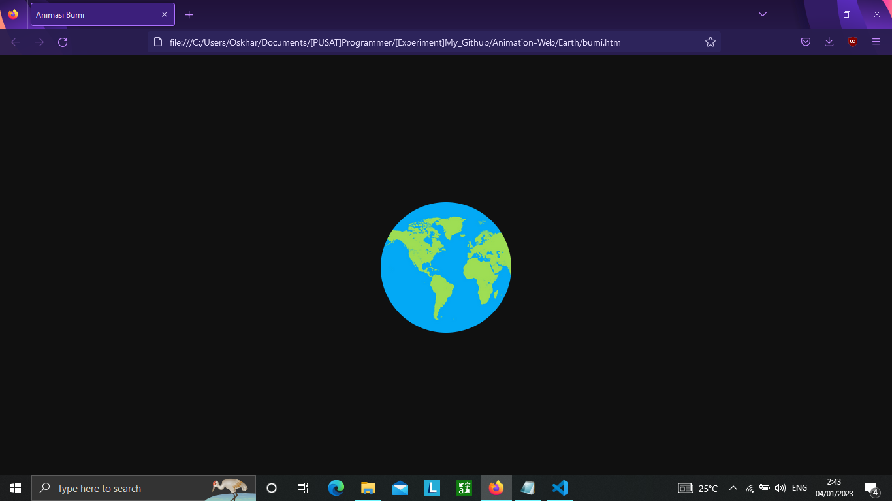
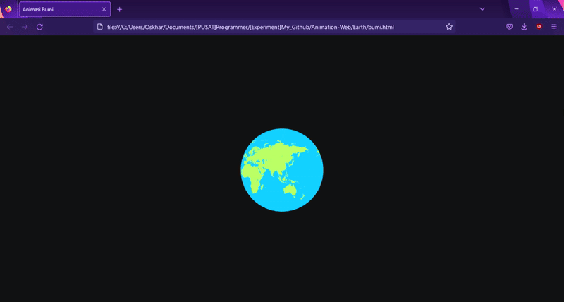
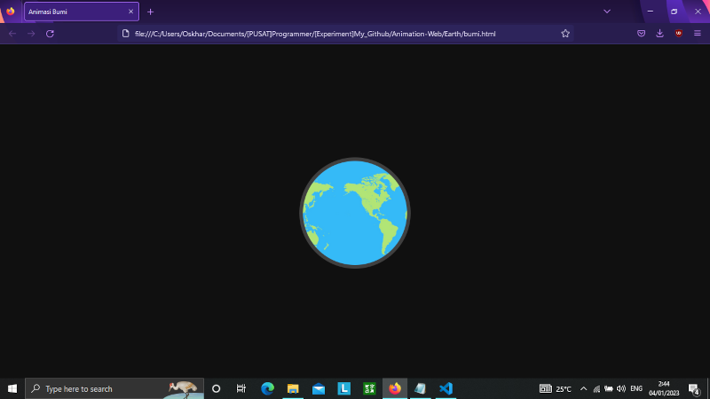

## Penjelasan Source Code

### HTML

Pada program html masih standar dan cukup sederhana, bisa kalian tiru atau dekorasi sesuai selera
```html
<!DOCTYPE html>
<html>
<head>
	<meta charset="utf-8">
	<meta name="viewport" content="width=device-width, initial-scale=1">
	<link rel="stylesheet" href="style.css">
	<title>Animasi Bumi</title>
</head>
<body>
	<div id="bumi"></div>
	<div id="moon"></div>
</body>
</html>
```

### CSS

Pada tahap awal akan dibuat program untuk mewarnai background menjadi hitam
```css
body{
	background: #101010;
}
```
#### Before
##### Gambar 1. Hasil atau Output dari program diatas

#### After
##### Gambar 2. Hasil atau Output dari program diatas


Mengatur posisi dan bentuk bumi berdasarkan id
```css
#bumi{
	height: 200px;
	width: 200px;
	border-radius: 50%;
	position: absolute;
	top: 35%;
	left: 50%;
	transform: translate(-50%,0);
	background: url('earth.jpg');
	background-size: auto 100%;
	animation: animasiBumi 13s linear infinite;
	z-index: 2;
}
```
##### Gambar 3. Hasil atau Output dari program diatas


Sekaran kita atur animasi pada gambar bumi. Saya menggunakan foto persegi panjang yang gambarnya akan digerakan dari kanan ke kiri agar terlihat seperti bumi yang sedang berputar.
```css
@KeyFrames animasiBumi{
	0%{background-position: 0%;}
	100%{background-position: 300%;}
}
```
##### Gambar 4. Hasil atau Output dari program diatas


Agar terlihat lebih nyata gambar buminya ditambahkan layer sebagai lapisan atmosfer
```css
#bumi::after{
	content: '';
	height: 214px;
	width: 214px;
	background: rgba(255, 255, 255, 0.2);
	position: absolute;
	left: -7px;
	top: -7px;
	border-radius: 50%;
}
```
##### Gambar 5. Hasil atau Output dari program diatas


Setelah menyelesaikan bagian bumi, sekarang mengatur gambar bulan. Pada program ini akan diatur bagaimana bentuk dan posisi bulan.
```css
#moon{
	height: 58px;
	width: 58px;
	position: absolute;
	right: 20%;
	top: 20%;
	border-radius: 50%;
	background: url('moon.jpg');
	background-size: 58px 58px;
	animation: animasiBulan 6s linear infinite;
}
```

Bentuk atau gambar bulan sudah tersusun, hanya perlu menambahkan sentuhan akhir untuk menggerakan bulan agar terlihat seolah bergerak 3D pada poros bulan mengelilingi bumi.
```css
@KeyFrames animasiBulan{
	0%{
		right: 20%;
		top: 20%;
		height: 40px;
		width: 40px;
		z-index: 3;
	}
	4%{
		right: 21%;
		top: 21%;
	}
	30%{
		height: 80px;
		width: 80px;
	}
	46%{
		right: 69%;
		top: 69%;
	}
	50%{
		right: 70%;
		top: 70%;
		height: 40px;
		width: 40px;
	}
	54%{
		right: 69%;
		top: 69%;
	}
	57%{
		z-index: 1;
	}
	80%{
		height: 30px;
		width: 30px;
	}
	96%{
		right: 21%;
		top: 21%;
		z-index: 1;
	}
	100%{
		right: 20%;
		top: 20%;
		height: 40px;
		width: 40px;
		z-index: 3;
	}
}
```